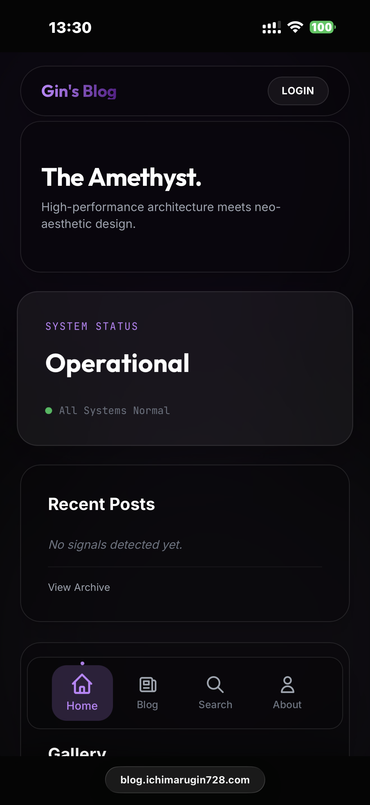

# Gins Blog (Neo-Aesthetics Edition) 💎

 

A high-performance, edge-first blog built with **Astro**, **Cloudflare Pages**, and **Neo-Aesthetics** design principles. Features glassmorphism, P3 wide color gamut, and AI-powered search.


> **Live Demo**: [blog.ichimarugin728.com](https://blog.ichimarugin728.com)

## ✨ Gallery

### 🌐 Core Experience
| Blog Index | About Page |
| :---: | :---: |
|  |  |

### 👤 User System
| Profile Customization | Identity Switching |
| :---: | :---: |
|  |  |

### 🛡️ Admin Suite
| Dashboard | CMS Editor |
| :---: | :---: |
|  |  |

### 📱 Extras
| Music Manager | Mobile View |
| :---: | :---: |
|  |  |

## 🚀 Key Features

-   **Neo-Aesthetics UI**: Full glassmorphism, fluid animations, and Display-P3 color support.
-   **PWA Support**: Installable as a native app on mobile and desktop devices.
-   **Profile Customization**: Users can seamlessly switch their profile identity (Avatar & Username) between connected providers (**GitHub**, **Google**, **Discord**) or use a custom upload.
-   **Edge-First Architecture**: Runs entirely on Cloudflare Workers/Pages.
-   **Full Stack**:
    -   **Database**: Cloudflare D1 (SQLite) with Drizzle ORM.
    -   **Storage**: Cloudflare R2 for media.
    -   **Cache**: Cloudflare KV for high-performance API caching.
    -   **AI Search**: Cloudflare Vectorize + Workers AI for semantic search.
-   **Secret Admin Panel**: Hidden route for content management (CRUD) & **Music Manager**.
-   **Auth**: OAuth (GitHub, Google, Discord) via Arctic + Oslo.

---

## 🛠️ Setup Guide

### 1. Prerequisites

-   Node.js (v20+)
-   pnpm or npm
-   Cloudflare Account (Free tier works, but AI/Vectorize might need Paid for higher limits)
-   Wrangler CLI (`npm i -g wrangler`)

### 2. Installation

```bash
git clone https://github.com/your-username/gins-blog.git
cd gins-blog
npm install
```

### 3. Cloudflare Configuration (Critical)

You need to create the separate Cloudflare resources and update `wrangler.jsonc`.

**a. Database (D1)**
```bash
wrangler d1 create gins-blog-db
# Copy the "database_id" output to your wrangler.jsonc
```

**b. Initialize Database**
```bash
npm run db:push
```

**c. KV Namespaces (Cache & Session)**
```bash
wrangler kv:namespace create GIN_KV
wrangler kv:namespace create SESSION
wrangler kv:namespace create GINS_CACHE
# Update "id" in wrangler.jsonc for each binding
```

**d. R2 Bucket (Media)**
```bash
wrangler r2 bucket create gins-media
# Update "bucket_name" in wrangler.jsonc if you chose a different name
```

**e. Vectorize & AI (Search)**
```bash
wrangler vectorize create gins-vector --dimensions=768 --metric=cosine
# Update "index_name" in wrangler.jsonc
```

### 4. Admin Panel Security (IMPORTANT 🔒)

The admin panel is protected by obscure routing (Security by Obscurity) + Middleware Auth.

-   **Rename the Admin Folder**:
    The admin panel lives in `src/pages/IchimaruGin728`.
    **You MUST rename this folder** to something only you know (e.g., `src/pages/my-secret-admin`).
    
    ```bash
    mv src/pages/IchimaruGin728 src/pages/YOUR_SECRET_ROUTE
    ```

    *If you don't do this, anyone who reads this code knows your login URL.*

    > **Strong Recommendation**: For maximum security, enable **Cloudflare Access (Zero Trust)** for this route. It adds an extra layer of authentication (like an Email PIN or Google Login) before anyone can even see your admin login page.

### 5. Environment Variables (`.dev.vars`)

Create a `.dev.vars` file in the root directory for local development secrets. **DO NOT COMMIT THIS FILE.**

```env
# Auth Providers (Get these from respective developer consoles)
GITHUB_CLIENT_ID=...
GITHUB_CLIENT_SECRET=...

GOOGLE_CLIENT_ID=...
GOOGLE_CLIENT_SECRET=...
GOOGLE_REDIRECT_URI=http://localhost:4321/login/google/callback

DISCORD_CLIENT_ID=...
DISCORD_CLIENT_SECRET=...
DISCORD_REDIRECT_URI=http://localhost:4321/login/discord/callback

# Admin Access Token (Optional, if using simple auth)
ADMIN_SECRET=...
```

For production, verify these variables in your Cloudflare Pages Dashboard -> Settings -> Environment Variables.

---

## 🎨 Customization

### Personal Info
Edit `src/pages/about.astro` to update your bio, timeline, and Gravatar hash.

### Config
Update `astro.config.mjs`:
```js
export default defineConfig({
  site: 'https://your-domain.com', // <--- Change this
  // ...
});
```

### UI & Tuning
-   **UnoCSS**: Edit `uno.config.ts` to change the `brand` color palette.
-   **Fonts**: `src/styles/global.css` or `uno.config.ts`.

---

## 🧞 Commands

| Command | Action |
| :--- | :--- |
| `npm run dev` | Start local dev server at `localhost:4321` |
| `npm run build` | Build your production site |
| `npm run preview` | Preview your build locally |
| `npm run deploy` | Deploy to Cloudflare Pages |
| `npm run db:push` | Push schema changes to D1 |

---

## 📜 License

- **Code**: All source code is licensed under the [MIT License](LICENSE).
- **Content & Design**: All articles, media, and unique **Neo-Aesthetics UI designs** are licensed under [CC BY-NC-SA 4.0](https://creativecommons.org/licenses/by-nc-sa/4.0/). You cannot clone the visual identity for commercial purposes without permission.

Feel free to use the code, but please credit me if you quote my articles! Cheers!
