<a name="top"></a>

# Gin's Blog ✨

<div align="center">

 


**A high-performance, edge-first blog platform built with modern web technologies**

[🌐 Live Demo](https://blog.ichimarugin728.com) • [📖 中文文档](./README.zh.md) • [📚 Documentation](/docs)
[🦞 OpenClaw Users](./AGENT_GUIDE.md): Just tell your agent: "Read AGENT_GUIDE.md and deploy this for me."

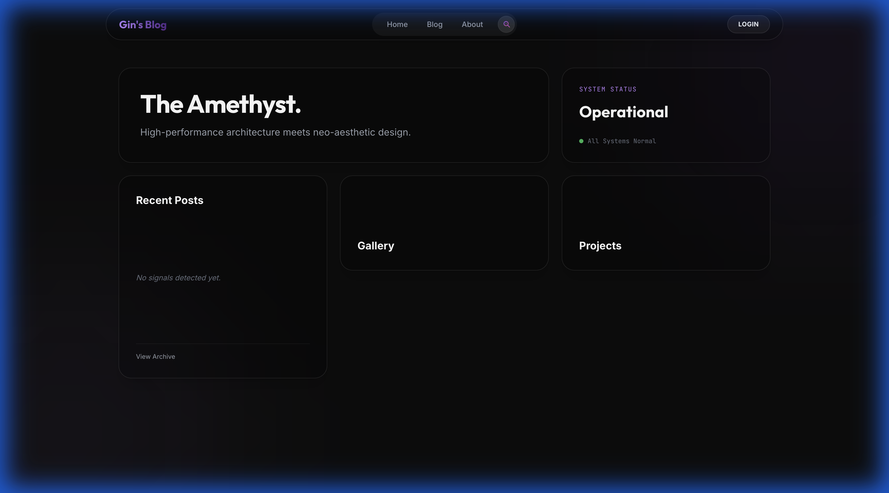

</div>

---

## 📋 Table of Contents

- [✨ Features](#-features)
- [🎨 Gallery](#-gallery)
- [🛠️ Tech Stack](#️-tech-stack)
- [🚀 Quick Start](#-quick-start)
- [📦 Deployment](#-deployment)
- [🎨 Customization](#-customization)
- [📜 License](#-license)

---

## ✨ Features

### 🎨 **Neo-Aesthetics Design**
- **Glassmorphism UI** - Frosted glass effects with backdrop blur
- **Fluid Animations** - Smooth transitions and micro-interactions
- **Safari-Style Mobile Nav** - Shrinking navigation bar with holographic text effects

### 📚 **Interactive Documentation Hub**
- **MDX Powered** - Write documentation with embedded interactive components
- **Bilingual Structure** - Dedicated `/docs` and `/zh/docs` routing identical to the main app
- **Animated Architecture** - View Transition API support for seamless navigation between guides

### 🌐 **Internationalization (i18n)**
- **Multi-Language Support** - Seamless English and Chinese (Simplified) experience
- **Dynamic Routing** - Smart routing for smooth language switching
- **Localized 404** - Client-side detected 404 pages that adapt to the user's language path (e.g. `/zh/*`)
- **Localized RSS** - Dedicated feeds for each language

### 🔍 **Advanced SEO**
- **Bilingual indexing** - `sitemap.xml` covers full English and Chinese content trees
- **Hreflang Support** - Precise language targeting (`en-SG`, `zh`) for search engines
- **Meta Optimization** - Dynamic `og:locale`, `keywords`, and rich social cards

### 🔐 **Authentication & Security**
- **OAuth Integration** - GitHub, Google, Discord via Arctic + Oslo
- **Active Session Management** - View and revoke active sessions across devices
- **Smart Sessions** - Device-aware tracking with automatic deduplication
- **Zero Trust Admin** - Protected admin routes with Cloudflare Access integration

### 📝 **Content Management**
- **Rich Markdown Editor** - Full CMS with live preview and media upload
- **File Upload Publishing** - Direct `.md` or `.rtf` file upload for quick publishing
- **Automatic Slug Generation** - SEO-friendly URL generation from titles
- **Scheduled Publishing** - Set publication dates for future posts
- **Music Manager** - Dedicated console for managing music/playlist data

### 🚀 **Performance & Infrastructure**
- **Edge-First Architecture** - Runs entirely on Cloudflare Workers/Pages
- **Smart Caching** - KV-based caching for API responses and homepage data
- **Prefetching** - Hover-to-load mechanics for instant page navigation
- **PWA Support** - Installable as a native app on mobile and desktop
- **Smart Routing** - Cloudflare Smart Placement for optimal latency

### 🎥 **Edge-Native Media Integration (Optional)**
- **Cloudflare Images** - Zero-latency, auto-optimized WebP/AVIF delivery via the `<CloudflareImage />` component. Optional, requires a separate Cloudflare purchase.
- **Cloudflare Stream** - Adaptive bitrate (HLS) streaming player for videos via the `<CloudflareVideo />` component. Optional, requires a separate Cloudflare purchase.
- **Integrated Admin Editor** - Securely upload Edge-Native media directly within your Markdown editor workspace without bloating your database or repo.
### 🤖 **AI-Powered Search**
- **Semantic Search** - Cloudflare Vectorize + Workers AI for intelligent content discovery
- **Multi-Language Support** - Search across both English and Chinese content
- **Instant Results** - Fast, edge-based vector search

### 📊 **Analytics & Insights**
- **Real-time View Counts** - Hybrid D1+KV architecture using `UPDATE ... RETURNING` for zero-latency, fresh view stats.
- **Edge Analytics Dashboard** - Monitor **100+ global Cloudflare nodes** with real-time RTT metrics.
  - 🌍 **Global Coverage**
    - **North America**: 35+ nodes (SJC, LAX, SEA, ORD, IAD...)
    - **Europe**: 35+ nodes (LHR, FRA, CDG, AMS...)
    - **Asia-Pacific**: 20+ nodes (NRT, SIN, HKG, SYD...)
  - ⚡ **Performance Monitoring** - Automatic routing anomaly detection (e.g., Singapore users routed to US West).
  - 📋 **Visual Data Grid** - Interactive tables with location flags, session counts, avg RTT, and performance ratings.
  - 🟢 **Real-time Metrics** - Live connection quality indicators:
    - **Excellent**: < 50ms
    - **Good**: < 150ms
    - **Poor**: > 150ms
  - 🔍 **Use Case**: Identify ISP routing issues (e.g., StarHub routing to wrong colo).
- **Enhanced Session Tracking** - Metadata includes:
  - **Network**: ISP name, ASN, HTTP Protocol (h2/h3), TCP RTT
  - **Security**: TLS Version (1.2/1.3), Client Trust Score
  - **Location**: City, Country, Coordinates
- **Adaptive UX Metrics** - Captures basic client capabilities (Network Type, Screen Size) to optimize content delivery.
  - *Privacy Note*: All analytics data is **self-hosted and private**, never shared with third parties.
- **Unified Modal UX** - Backdrop click-to-close, 300ms fade+scale animations, consistent red-hover close buttons.

### 🎨 **Icon System Optimization**
- ✨ **Sharp Rendering** - `shape-rendering: geometricPrecision` for crisp SVG edges.
- 🚀 **Zero Latency** - Local inline SVGs with **Safelist Preloading** (No FOUC).
- 💨 **Optimized Loading** - Pre-compiled icons for instant display without external network requests.

### 🧠 **Agentic Core: The First-Class AI Interface**

**Gins Blog is not just a static site; it is a fully compliant Agentic Interface via the Model Context Protocol (MCP).**

Built with an Edge-First MCP Server, you can connect **Claude Desktop**, **OpenClaw**, or **Cursor** to your deployed blog, effectively turning your chat window into a **Headless CMS**.

- 📝 **Conversational Drafting** - *"Draft a new post about my coding session today and save it."*
- 🕵️ **Intelligent Insights** - *"Analyze traffic from the last 24 hours and identify trends."*
- 🛡️ **Auto-Moderation** - *"Scan recent comments for spam or sentiment analysis."*

✅ **Zero-Config Ready**: Includes `openclaw.json` and standard MCP client scripts for instant connection.

> 🔗 **Get Started:** Check the [MCP Usage Guide](./MCP_GUIDE.md) to unlock agentic capabilities.
> 🦞 **Zero-Touch Deployment:** Just tell OpenClaw to "Read [AGENT_GUIDE.md](./AGENT_GUIDE.md) and deploy this for me."

---

## 🎨 Gallery

<details>
<summary>Click to expand gallery</summary>

### 🌐 Core Experience
| Blog Index | About Page |
| :---: | :---: |
| 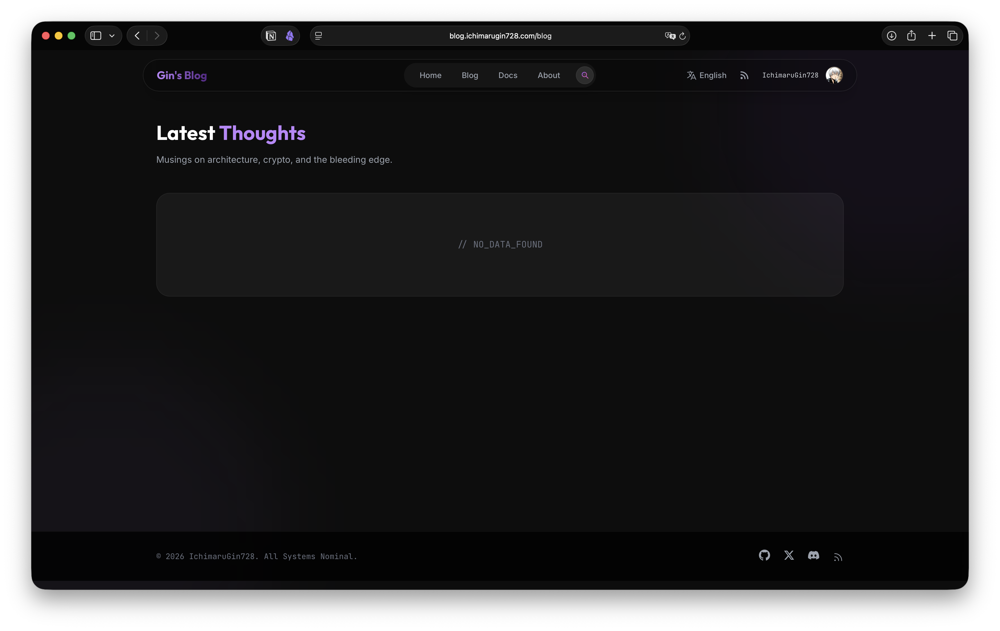 | 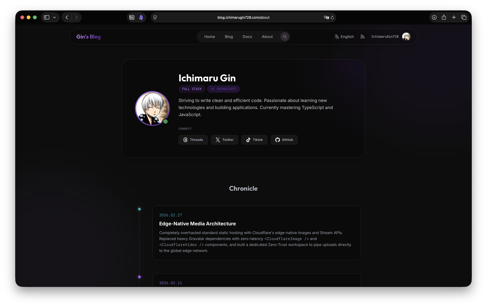 |

### 🔍 Explore & Learn
| AI Vector Search | Documentation Hub | I18n Support |
| :---: | :---: | :---: |
| 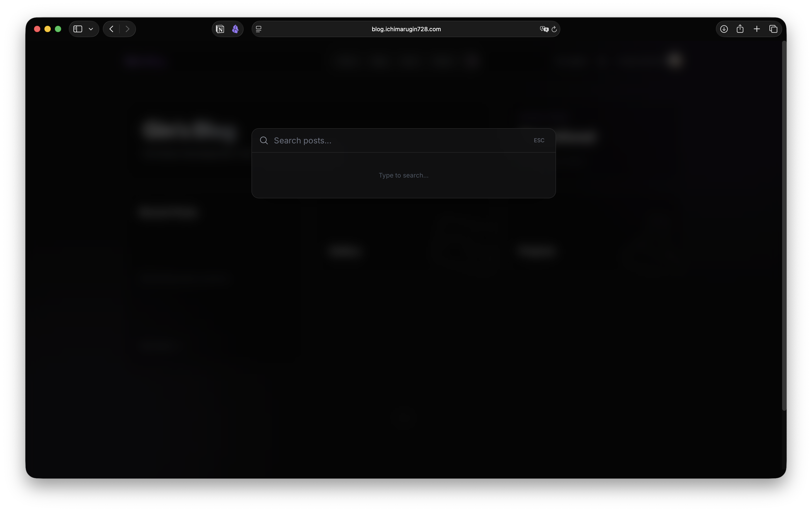 | 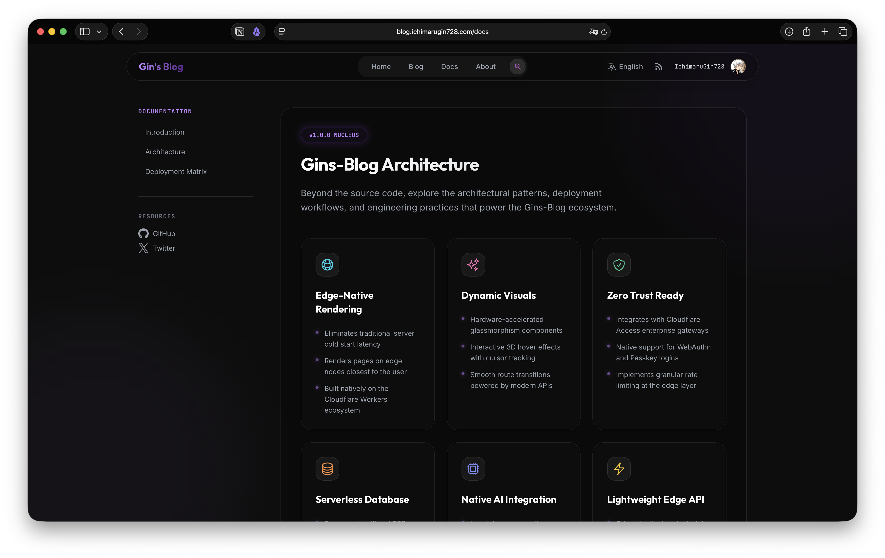 | 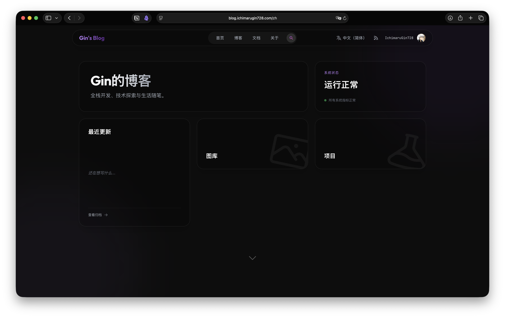 |

### 👤 User System
| Authentication | Profile Customization | Identity Switching |
| :---: | :---: | :---: |
| 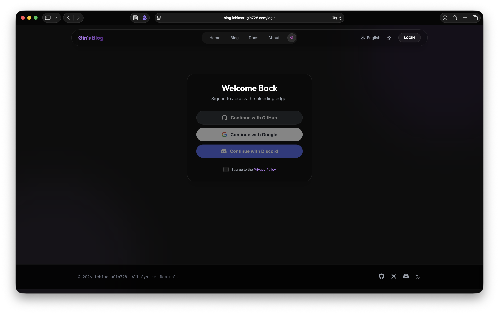 | 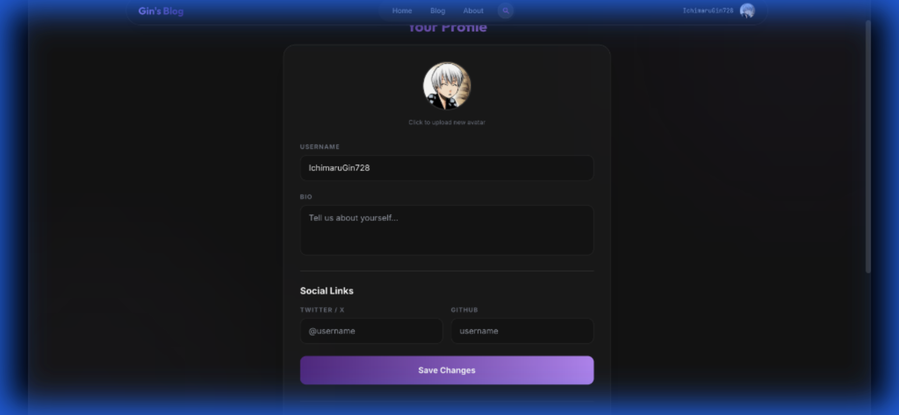 | 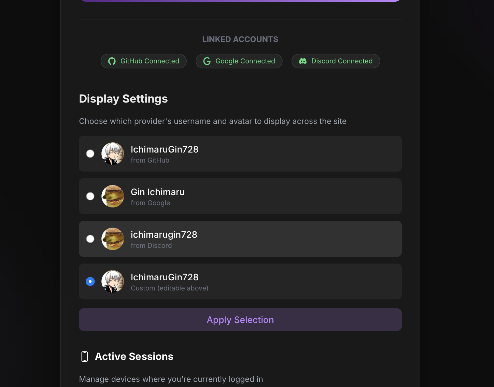 |

### 🛡️ Admin & Content
| Dashboard | CMS Editor | Music Manager |
| :---: | :---: | :---: |
| 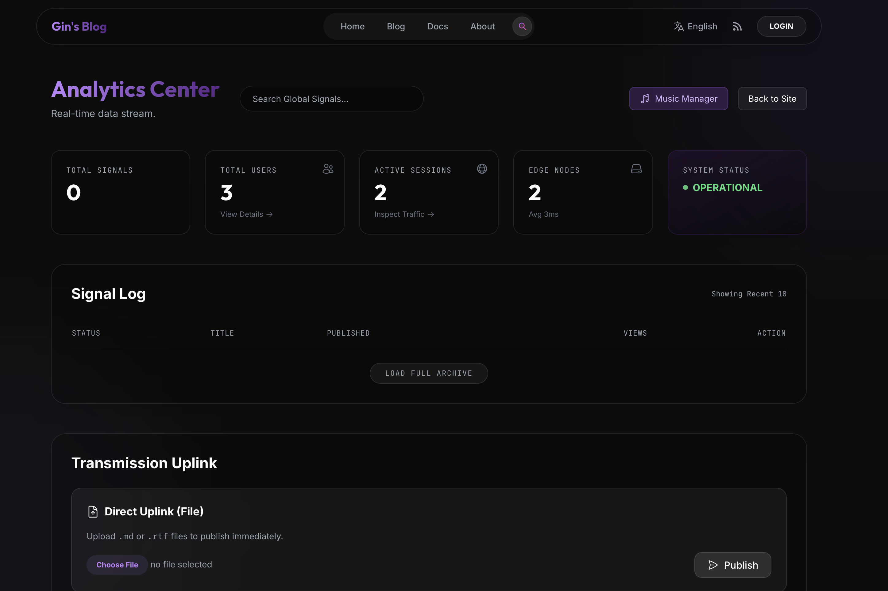 | 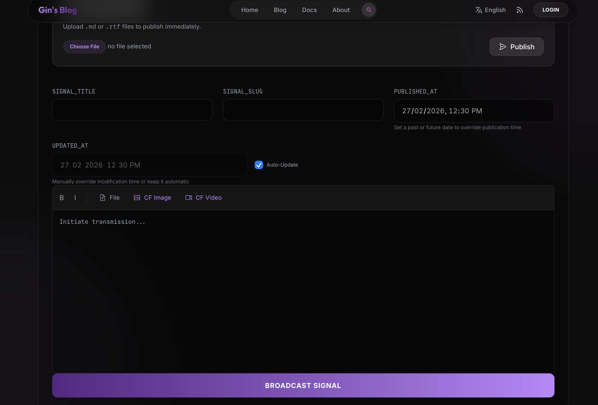 | 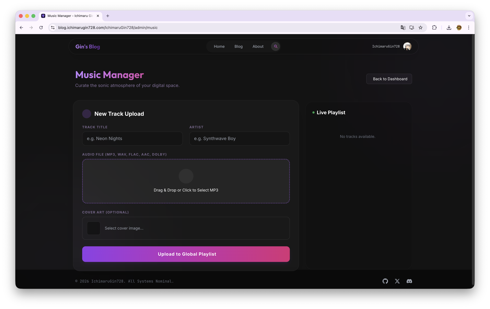 |

### 📱 Responsive Design
| Mobile View |
| :---: |
| 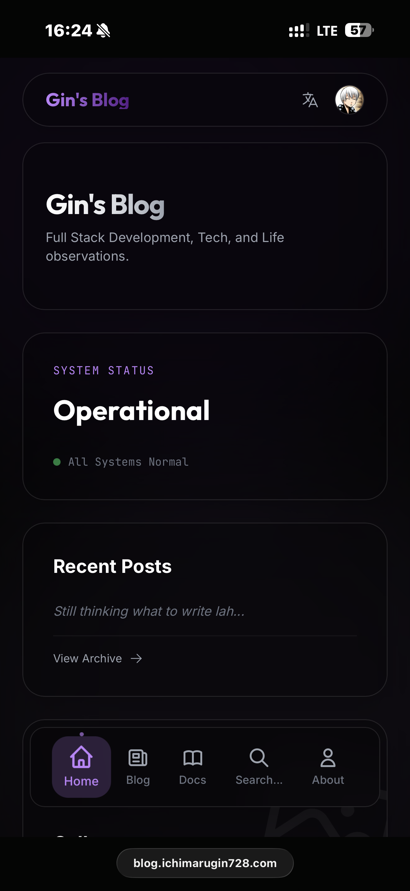 |

</details>

---

## 🛠️ Tech Stack

### **Frontend**
| Technology | Version | Purpose |
|------------|---------|---------|
| [Astro](https://astro.build) | `v6.1.x` | Static site generator with Cloudflare-native server output |
| [Preact](https://preactjs.com) | `v10.29.x` | Lightweight React alternative for interactive components |
| [UnoCSS](https://unocss.dev) | `v66.6.x` | Instant on-demand atomic CSS engine (Replaces Tailwind) |
| [Satori](https://github.com/vercel/satori) | `v0.26.x` | SVG-based OG image generation |
| [Biome](https://biomejs.dev) | `v2.4.x` | Fast All-in-One Formatter & Linter (Replaces ESLint/Prettier) |

### **Backend & Edge**
| Technology | Version | Purpose |
|------------|---------|---------|
| [pnpm](https://pnpm.io) | `v10.33+` | Fast, disk space efficient package manager |
| [JSR](https://jsr.io) | Latest | Modern open-source package registry |
| [Cloudflare Workers](https://workers.cloudflare.com) | - | Serverless edge compute platform |
| [GitHub Actions](https://github.com/features/actions) | - | Automated CI/CD deployment pipeline |
| [Hono](https://hono.dev) | Latest | Ultrafast web framework for robust API Routes (`/api/*`) |
| [Drizzle ORM](https://orm.drizzle.team) | Latest | Type-safe SQL ORM for Cloudflare D1 |

### **Database & Storage**
| Technology | Purpose |
|------------|---------|
| [Cloudflare D1](https://developers.cloudflare.com/d1) | SQLite-based serverless SQL database |
| [Cloudflare R2](https://developers.cloudflare.com/r2) | S3-compatible object storage for media |
| [Cloudflare KV](https://developers.cloudflare.com/kv) | Low-latency key-value store for caching & sessions |
| [Cloudflare Vectorize](https://developers.cloudflare.com/vectorize) | Vector database for AI-powered search |
| [Cloudflare Images](https://developers.cloudflare.com/images/) | Image optimization and delivery |
| [Cloudflare Stream](https://developers.cloudflare.com/stream/) | Video streaming and encoding |

### **AI & Search**
| Technology | Purpose |
|------------|---------|
| [Workers AI](https://developers.cloudflare.com/workers-ai) | Serverless AI models for embeddings |
| [Vectorize](https://developers.cloudflare.com/vectorize) | Vector similarity search (768-dim, cosine) |

### **Authentication**
| Technology | Purpose | Version |
|------------|---------|---------|
| [Arctic](https://arctic.js.org) | OAuth 2.0 client library | Latest |
| [Oslo](https://oslo.js.org) | Auth utilities (sessions, PKCE, etc.) | Latest |

### **Utilities**
| Technology | Purpose | Version |
|------------|---------|---------|
| [Marked](https://marked.js.org) | Markdown parser for content | `v18.x` |
| [Zod](https://zod.dev) | TypeScript-first schema validation | `v4.3.x` |
| [TypeScript](https://www.typescriptlang.org) | Type-safe JavaScript | `v5.9.x` |

---

## 🚀 Quick Start

### **Prerequisites**

Before you begin, ensure you have the following installed:

- **Node.js** `25.9.0+`
- **pnpm** `10.33+` ([Install](https://pnpm.io/installation))
- **Cloudflare Account** ([Sign up for free](https://dash.cloudflare.com/sign-up))
- **Wrangler CLI** (Cloudflare's command-line tool)

```bash
corepack enable
corepack prepare pnpm@10.33.0 --activate
pnpm add -g wrangler
```

If you use `nvm`, this repo already ships with `.nvmrc`:

```bash
nvm use
```

---

### **Step 1: Clone the Repository**

```bash
git clone https://github.com/your-username/gins-blog.git
cd gins-blog
pnpm install
```

---

### **Step 2: Automated Cloudflare Setup**
Select the method that best suits your workflow:

#### **Method A: Interactive Setup Script (✨ Highly Recommended)**
The fastest path for a fresh account. It provisions D1, KV, R2, rewrites `wrangler.jsonc`, writes `.env` / `.dev.vars`, updates `openclaw.json`, and pushes the schema.
```bash
pnpm run bootstrap
```

If you already installed dependencies and only want to provision Cloudflare resources:

```bash
pnpm run setup
```

#### **Method B: AI / CI Agent Mode**
For OpenClaw, Cursor, or CI pipelines.
```bash
pnpm run setup -- --suffix=prod --setup-ai=false
```

#### **Method C: Manual Mode**
For advanced users. Refer to `scripts/setup.js` logic to execute `wrangler` commands and update `wrangler.jsonc` manually.

---

The setup script handles:
1. **Environment check** - verifies Wrangler is installed and authenticated.
2. **Resource creation** - creates D1, KV, and R2 resources.
3. **Config patching** - writes the generated IDs, route mode, and OAuth callback URLs back into `wrangler.jsonc`.
4. **Site URL bootstrap** - writes `SITE_URL` into `.env` for canonical URLs, sitemap, and RSS.
5. **Schema bootstrap** - runs `pnpm run db:push`.

### **Step 2.1: (Optional) Configure AI Search**

If you want to enable AI Semantic Search:

1. Create a Vectorize Index:
   ```bash
   wrangler vectorize create gins-vector --dimensions=768 --metric=cosine
   ```
2. Or simply rerun `pnpm run setup -- --suffix=prod --setup-ai=true`.

### **Step 3: Configure OAuth Providers**

Create `.env` and `.dev.vars` files in the root directory:

```env
SITE_URL=https://blog.example.com

# GitHub OAuth (https://github.com/settings/developers)
GITHUB_CLIENT_ID=your_github_client_id
GITHUB_CLIENT_SECRET=your_github_client_secret

# Google OAuth (https://console.cloud.google.com/apis/credentials)
GOOGLE_CLIENT_ID=your_google_client_id
GOOGLE_CLIENT_SECRET=your_google_client_secret
GOOGLE_REDIRECT_URI=http://localhost:4321/login/google/callback

# Discord OAuth (https://discord.com/developers/applications)
DISCORD_CLIENT_ID=your_discord_client_id
DISCORD_CLIENT_SECRET=your_discord_client_secret
DISCORD_REDIRECT_URI=http://localhost:4321/login/discord/callback

# Optional only if you purchased Cloudflare Images + Stream
CLOUDFLARE_ACCOUNT_ID=your_cloudflare_account_id
CLOUDFLARE_ACCOUNT_HASH=your_cloudflare_account_hash
CLOUDFLARE_MEDIA_API_TOKEN=your_media_api_token
PUBLIC_CF_AVATAR_ID=your_avatar_image_id_or_r2_path
PUBLIC_ASSETS_DOMAIN=assets.yourdomain.com
```

> **⚠️ IMPORTANT:** Add `.dev.vars` to your `.gitignore` to prevent committing secrets!
> `SITE_URL` belongs in `.env`, while credentials belong in `.dev.vars`.

---

### **Step 4: Secure Your Admin Panel**

The admin panel is currently located at `/IchimaruGin728/admin`. **You must rename this folder** to something unique:

```bash
mv src/pages/IchimaruGin728 src/pages/YOUR_SECRET_ROUTE
```

For example:
```bash
mv src/pages/IchimaruGin728 src/pages/my-secret-admin-panel
```

> **🔒 Pro Tip:** Enable [Cloudflare Access (Zero Trust)](https://developers.cloudflare.com/cloudflare-one/applications/) for your admin route for maximum security.

---

### **Step 5: Run Locally**

```bash
pnpm run dev
```

Visit `http://localhost:4321` 🎉

---

## 📦 Deployment

### **Recommended Manual Deploy**

This is the shortest reliable production path:

```bash
pnpm install
pnpm run setup -- --suffix=prod
pnpm run build
pnpm run deploy
```

`pnpm run deploy` builds the site and deploys the generated Worker entry at `dist/_worker.js/index.js`.

### **Production Secrets**

Set runtime secrets directly on the Worker:

```bash
wrangler secret put GITHUB_CLIENT_SECRET
wrangler secret put GOOGLE_CLIENT_SECRET
wrangler secret put DISCORD_CLIENT_SECRET
wrangler secret put CLOUDFLARE_MEDIA_API_TOKEN
```

Set non-secret runtime vars in `wrangler.jsonc`:
- `GITHUB_REDIRECT_URI`
- `GOOGLE_REDIRECT_URI`
- `DISCORD_REDIRECT_URI`
- `PUBLIC_CF_AVATAR_ID`
- `PUBLIC_ASSETS_DOMAIN`

Keep the deploy token and media token separate. `CLOUDFLARE_API_TOKEN` is for deployment, while `CLOUDFLARE_MEDIA_API_TOKEN` is only for runtime uploads.

### **GitHub Actions Deploy**

If you deploy from GitHub Actions, add:
- `CLOUDFLARE_API_TOKEN`
- `CLOUDFLARE_ACCOUNT_ID`
- Repository variable `SITE_URL`

Then push to `main` to trigger `.github/workflows/deploy.yml`.

---

## 🎨 Customization

### **Update Personal Information**

Edit `src/pages/about.astro` and `src/pages/zh/about.astro` to update:
- Bio and timeline
- Social links
- Cloudflare Image ID & Account Hash

### **Change Site Configuration**

Update `.env` or your CI variable:

```bash
SITE_URL=https://your-domain.com
```

### **Customize Branding**

**Colors:** Edit `uno.config.ts`

```ts
export default defineConfig({
  theme: {
    colors: {
      brand: {
        primary: '#8b5cf6',    // Your primary color
        accent: '#a78bfa',     // Your accent color
        // ...
      }
    }
  }
});
```

**Fonts:** Edit `src/styles/global.css` or update font imports in `uno.config.ts`.

---

## 📜 License

- **Code**: Licensed under the [MIT License](LICENSE).
- **Content & Design**: All articles, media, and unique **Neo-Aesthetics UI designs** are licensed under. [CC BY-NC-SA 4.0](https://creativecommons.org/licenses/by-nc-sa/4.0/).
- **Privacy**: Please refer to our [Privacy Policy](PRIVACY.md).

You're free to use the code, but please credit me if you reference my articles or design work. Commercial use of the visual identity requires permission.

---

## 🙏 Acknowledgments

Built with ❤️ using modern web technologies. Special thanks to:
- The Astro team for an amazing framework
- Cloudflare for making edge computing accessible
- The open-source community

---

<div align="center">

**[⬆ Back to Top](#top)**

Made with 💜 by [Ichimaru Gin](https://github.com/IchimaruGin728)

</div>
