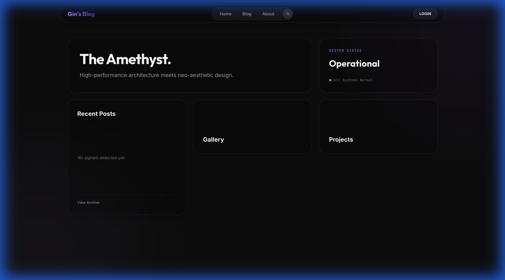
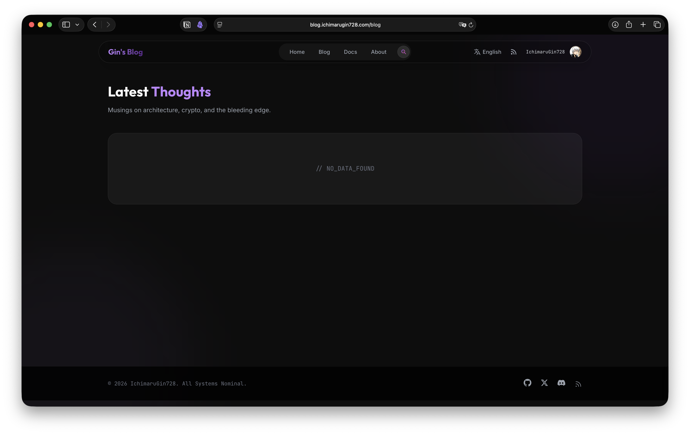
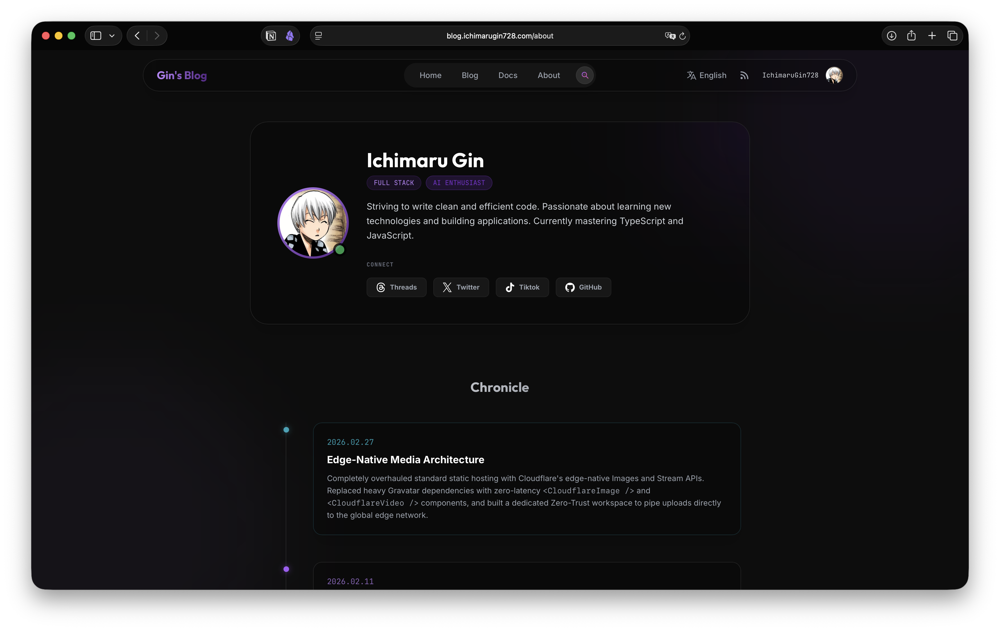
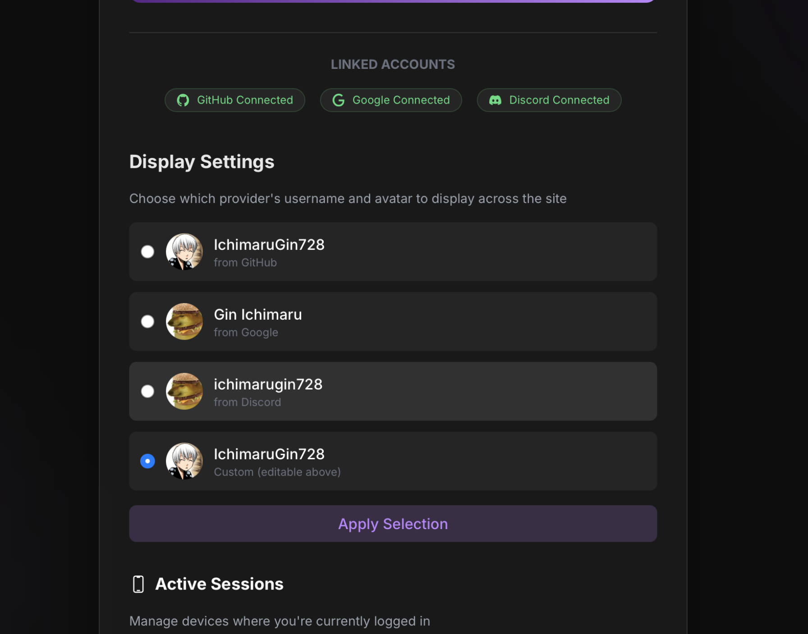
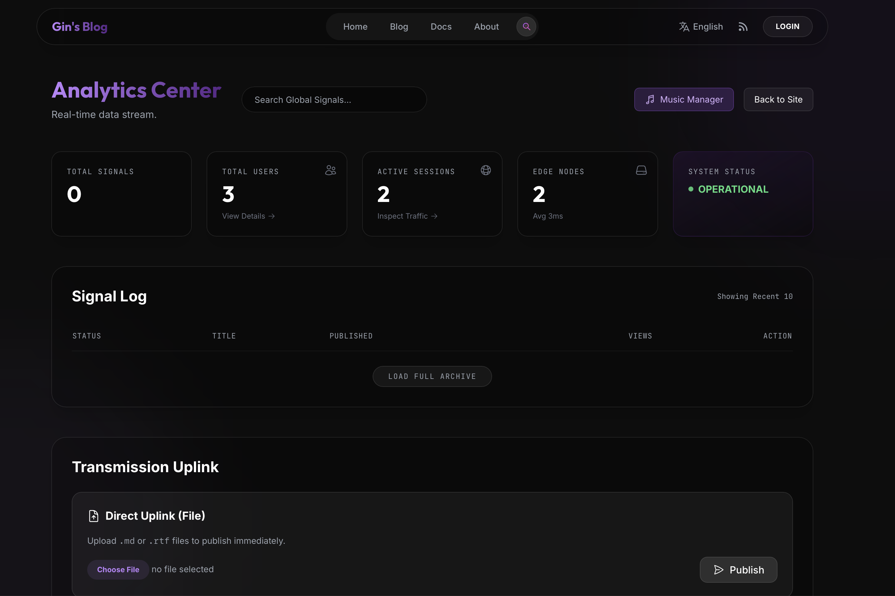
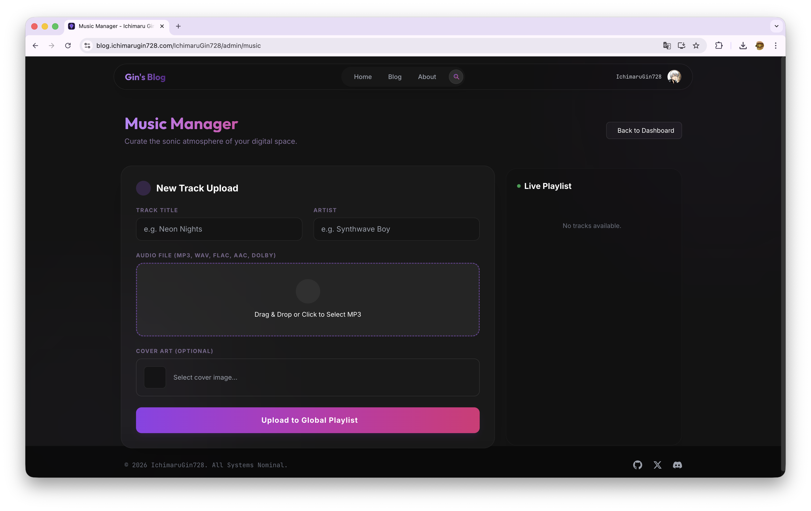
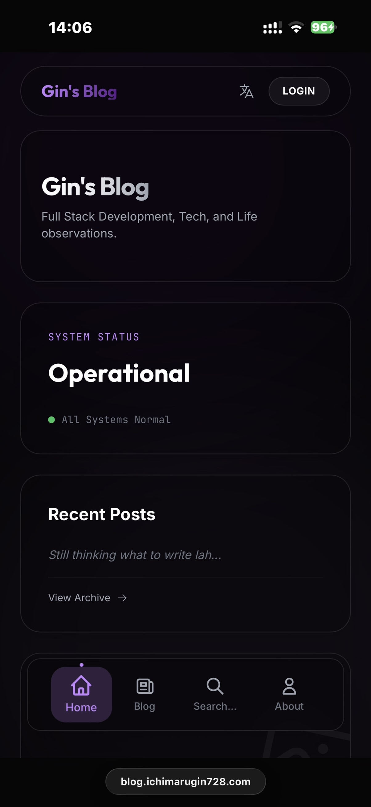

# Gin 的博客 💎

<div align="center">

 


**一个基于现代 Web 技术构建的高性能边缘优先博客平台**

[🌐 在线演示](https://blog.ichimarugin728.com) • [📖 English Documentation](./README.md)



</div>

---

## 📋 目录

- [✨ 特性](#-特性)
- [🎨 界面展示](#-界面展示)
- [🛠️ 技术栈](#️-技术栈)
- [🚀 快速开始](#-快速开始)
- [📦 部署](#-部署)
- [🎨 自定义配置](#-自定义配置)
- [📜 开源协议](#-开源协议)

---

## ✨ 特性

### 🎨 **新美学设计**
- **玻璃态拟物化 UI** - 磨砂玻璃效果与背景模糊
- **流畅动画** - 平滑的过渡效果和微交互
- **Safari 风格移动导航** - 滚动时收缩的导航栏，带全息文字效果

### 🌐 **智能国际化**
- **混合语言策略** - 内部使用 `zh-SG` 格式，对外呈现简洁的 `/zh/` 链接
- **动态路由映射** - 自定义路由逻辑实现无缝语言切换
- **本地化 RSS** - 英语 (`/rss.xml`) 与中文 (`/zh/rss.xml`) 独立订阅源

### 🔍 **SEO 深度优化**
- **双语索引** - `sitemap.xml` 完整覆盖中英文内容树
- **Hreflang 支持** - 精准的语言目标定位 (`en-SG`, `zh`)，助力搜索引擎识别
- **Meta 增强** - 动态 `og:locale`、关键词支持及丰富的社交分享卡片

### 🔐 **认证与安全**
- **OAuth 集成** - 通过 Arctic + Oslo 支持 GitHub、Google、Discord
- **智能会话** - 支持设备感知的会话追踪与自动去重
- **零信任管理员** - 受 Cloudflare Access 保护的管理路由

### 📝 **内容管理**
- **富文本 Markdown 编辑器** - 完整的 CMS，支持实时预览和媒体上传
- **文件上传发布** - 直接上传 `.md` 或 `.rtf` 文件快速发布
- **自动生成 Slug** - 从标题自动生成 SEO 友好的 URL
- **定时发布** - 为未来的文章设置发布日期
- **音乐管理器** - 专用控制台管理音乐/播放列表数据

### 🚀 **性能与基础设施**
- **边缘优先架构** - 完全在 Cloudflare Workers/Pages 上运行
- **智能缓存** - 基于 KV 的 API 响应和主页数据缓存
- **预取加载** - 鼠标悬停即加载，实现即时页面导航
- **PWA 支持** - 可在移动端和桌面端作为原生应用安装
- **智能路由** - Cloudflare Smart Placement 优化延迟

### 🤖 **AI 驱动搜索**
- **语义搜索** - 使用 Cloudflare Vectorize + Workers AI 实现智能内容发现
- **多语言支持** - 跨英文和中文内容搜索
- **即时结果** - 快速的边缘向量搜索

---

## 🎨 界面展示

<details>
<summary>点击展开图库</summary>

### 🌐 核心体验
| 博客索引 | 关于页面 |
| :---: | :---: |
|  |  |

### 👤 用户系统
| 个人资料自定义 | 身份切换 |
| :---: | :---: |
|  |  |

### 🛡️ 管理套件
| 仪表板 | CMS 编辑器 |
| :---: | :---: |
|  |  |

### 📱 移动体验
| 音乐管理器 | 移动视图 |
| :---: | :---: |
|  |  |

</details>

---

## 🛠️ 技术栈

### **前端**
| 技术 | 用途 | 版本 |
|------|------|------|
| [Astro](https://astro.build) | 支持服务端渲染的静态站点生成器 | Latest |
| [Preact](https://preactjs.com) | 用于交互组件的轻量级 React 替代品 | Latest |
| [UnoCSS](https://unocss.dev) | 即时按需原子化 CSS 引擎 | Latest |
| [Satori](https://github.com/vercel/satori) | 基于 SVG 的 OG 图片生成 | ^0.19.1 |

### **后端与边缘**
| 技术 | 用途 | 版本 |
|------|------|------|
| [Cloudflare Workers](https://workers.cloudflare.com) | 无服务器边缘计算平台 | - |
| [Cloudflare Pages](https://pages.cloudflare.com) | 带边缘函数的静态站点托管 | - |
| [Hono](https://hono.dev) | 适用于 Workers 的超快 Web 框架 | Latest |
| [Drizzle ORM](https://orm.drizzle.team) | 类型安全的 D1 SQL ORM | Latest |

### **数据库与存储**
| 技术 | 用途 |
|------|------|
| [Cloudflare D1](https://developers.cloudflare.com/d1) | 基于 SQLite 的无服务器 SQL 数据库 |
| [Cloudflare R2](https://developers.cloudflare.com/r2) | 兼容 S3 的媒体对象存储 |
| [Cloudflare KV](https://developers.cloudflare.com/kv) | 用于缓存和会话的低延迟键值存储 |
| [Cloudflare Vectorize](https://developers.cloudflare.com/vectorize) | AI 驱动搜索的向量数据库 |

### **AI 与搜索**
| 技术 | 用途 |
|------|------|
| [Workers AI](https://developers.cloudflare.com/workers-ai) | 用于嵌入的无服务器 AI 模型 |
| [Vectorize](https://developers.cloudflare.com/vectorize) | 向量相似度搜索（768 维，余弦距离）|

### **认证**
| 技术 | 用途 | 版本 |
|------|------|------|
| [Arctic](https://arctic.js.org) | OAuth 2.0 客户端库 | Latest |
| [Oslo](https://oslo.js.org) | 认证工具（会话、PKCE 等）| Latest |

### **工具**
| 技术 | 用途 | 版本 |
|------|------|------|
| [Marked](https://marked.js.org) | 内容的 Markdown 解析器 | ^17.0.1 |
| [Zod](https://zod.dev) | TypeScript 优先的模式验证 | ^3.25.76 |
| [TypeScript](https://www.typescriptlang.org) | 类型安全的 JavaScript | ^5.9.3 |

---

## 🚀 快速开始

### **前置要求**

开始之前，请确保已安装以下内容：

- **Node.js** `24+` ([下载](https://nodejs.org))
- **npm** 或 **pnpm**（Node.js 自带）
- **Cloudflare 账户** ([免费注册](https://dash.cloudflare.com/sign-up))
- **Wrangler CLI**（Cloudflare 的命令行工具）

```bash
npm install -g wrangler
```

---

### **步骤 1：克隆仓库**

```bash
git clone https://github.com/your-username/gins-blog.git
cd gins-blog
npm install
```

---

### **步骤 2：设置 Cloudflare 资源**

您需要创建多个 Cloudflare 资源。请仔细按照以下步骤操作。

#### **2.1 创建 D1 数据库**

```bash
wrangler d1 create gins-blog-db
```

**输出：**
```
database_id = "abc123-def456-ghi789"
```

复制 `database_id` 并更新 `wrangler.jsonc`：

```jsonc
{
  "d1_databases": [
    {
      "binding": "DB",
      "database_name": "gins-blog-db",
      "database_id": "abc123-def456-ghi789" // <--- 粘贴到这里
    }
  ]
}
```

#### **2.2 初始化数据库架构**

```bash
npm run db:push
```

这将创建所有必要的表（`users`、`sessions`、`posts`、`comments`、`likes`、`music`）。

---

#### **2.3 创建 KV 命名空间**

```bash
# 缓存命名空间
wrangler kv namespace create GINS_CACHE

# 会话命名空间
wrangler kv namespace create SESSION

# 通用 KV 命名空间
wrangler kv namespace create GIN_KV
```

对于每个命令，您将获得一个 `id`。更新 `wrangler.jsonc`：

```jsonc
{
  "kv_namespaces": [
    {
      "binding": "GINS_CACHE",
      "id": "your-cache-namespace-id"
    },
    {
      "binding": "SESSION",
      "id": "your-session-namespace-id"
    },
    {
      "binding": "GIN_KV",
      "id": "your-kv-namespace-id"
    }
  ]
}
```

---

#### **2.4 创建 R2 存储桶**

```bash
wrangler r2 bucket create gins-media
```

更新 `wrangler.jsonc`：

```jsonc
{
  "r2_buckets": [
    {
      "binding": "GINS_MEDIA",
      "bucket_name": "gins-media"
    }
  ]
}
```

---

#### **2.5 创建 Vectorize 索引（可选 - 用于 AI 搜索）**

```bash
wrangler vectorize create gins-vector --dimensions=768 --metric=cosine
```

更新 `wrangler.jsonc`：

```jsonc
{
  "vectorize": [
    {
      "binding": "VECTORIZE",
      "index_name": "gins-vector"
    }
  ]
}
```

---

### **步骤 3：配置 OAuth 提供商**

在根目录创建 `.dev.vars` 文件：

```env
# GitHub OAuth (https://github.com/settings/developers)
GITHUB_CLIENT_ID=your_github_client_id
GITHUB_CLIENT_SECRET=your_github_client_secret

# Google OAuth (https://console.cloud.google.com/apis/credentials)
GOOGLE_CLIENT_ID=your_google_client_id
GOOGLE_CLIENT_SECRET=your_google_client_secret
GOOGLE_REDIRECT_URI=http://localhost:4321/login/google/callback

# Discord OAuth (https://discord.com/developers/applications)
DISCORD_CLIENT_ID=your_discord_client_id
DISCORD_CLIENT_SECRET=your_discord_client_secret
DISCORD_REDIRECT_URI=http://localhost:4321/login/discord/callback
```

> **⚠️ 重要提示：** 将 `.dev.vars` 添加到您的 `.gitignore` 以防止提交机密信息！

---

### **步骤 4：保护您的管理面板**

管理面板当前位于 `/IchimaruGin728/admin`。**您必须将此文件夹重命名**为唯一的名称：

```bash
mv src/pages/IchimaruGin728 src/pages/YOUR_SECRET_ROUTE
```

例如：
```bash
mv src/pages/IchimaruGin728 src/pages/my-secret-admin-panel
```

> **🔒 专业提示：** 为您的管理路由启用 [Cloudflare Access（零信任）](https://developers.cloudflare.com/cloudflare-one/applications/)以获得最大安全性。

---

### **步骤 5：本地运行**

```bash
npm run dev
```

访问 `http://localhost:4321` 🎉

---

## 📦 部署

### **部署到 Cloudflare Pages**

1. **设置生产环境变量：**

前往您的 [Cloudflare Pages 仪表板](https://dash.cloudflare.com) → 选择您的项目 → 设置 → 环境变量

添加 `.dev.vars` 中的所有变量（使用生产值作为重定向 URI）。

2. **部署：**

```bash
npm run deploy
```

或将您的 GitHub 仓库连接到 Cloudflare Pages 以在推送时自动部署。

---

## 🎨 自定义配置

### **更新个人信息**

编辑 `src/pages/about.astro` 和 `src/pages/zh-SG/about.astro` 以更新：
- 简介和时间轴
- 社交链接
- Gravatar 哈希

### **更改站点配置**

更新 `astro.config.mjs`：

```js
export default defineConfig({
  site: 'https://your-domain.com', // 您的生产 URL
  // ...
});
```

### **自定义品牌**

**颜色：** 编辑 `uno.config.ts`

```ts
export default defineConfig({
  theme: {
    colors: {
      brand: {
        primary: '#8b5cf6',    // 您的主色
        accent: '#a78bfa',     // 您的强调色
        // ...
      }
    }
  }
});
```

**字体：** 编辑 `src/styles/global.css` 或更新 `uno.config.ts` 中的字体导入。

---

## 📜 开源协议

- **代码**：根据 [MIT 许可证](LICENSE) 授权。
- **内容与设计**：所有文章、媒体和独特的**新美学 UI 设计**根据 [CC BY-NC-SA 4.0](https://creativecommons.org/licenses/by-nc-sa/4.0/) 授权。

您可以自由使用代码，但如果引用我的文章或设计作品，请注明出处。视觉标识的商业用途需要许可。

---

## 🙏 致谢

使用 ❤️ 和现代 Web 技术构建。特别感谢：
- Astro 团队提供的出色框架
- Cloudflare 让边缘计算变得易于访问
- 开源社区

---

<div align="center">

**[⬆ 返回顶部](#gin-的博客-)**

用 💜 制作 by [Ichimaru Gin](https://github.com/IchimaruGin728)

</div>
