# Gins-Blog: The Nexus

Welcome to the central documentation hub for **Gins-Blog**. This isn't just a theme; it is a carefully crafted foundation for the edge-native web. 

Designed to move beyond monolithic CMS architectures and visually evolve traditional minimalist themes (like *Rin*), Gins-Blog operates on a strictly "Zero-Cold-Start", globally distributed philosophy.

> [!NOTE]
> This documentation is designed to help developers and advanced users understand the platform. The following pages explain the deep architectural decisions of the platform.

## Core Philosophy

Traditional blogging engines parse massive bundles on cold servers. Gins-Blog shifts the entire paradigm to the Edge via Cloudflare Workers. 

1. **Liquid Glass Aesthetic:** I employ hardware-accelerated CSS over heavy WebGL, ensuring a dynamic, cinematic UI that runs at 120fps even on mobile devices.
2. **Serverless D1 Engine:** Eliminates connection pooling limitations. I utilize SQLite perfectly distributed at the edge, typed seamlessly by Drizzle ORM.
3. **Zero Trust Integration:** Security isn't an afterthought; it's the foundation. WebAuthn, hardware tokens, and Cloudflare Zero Trust are first-class citizens.

## System Schematic

```mermaid
graph TD;
    A[Client User] -->|HTTPS / WSS| B(Cloudflare Edge);
    B --> C{Worker Runtime};
    C -->|Render| D[Astro SSR];
    C -->|API| E[Hono RPC];
    E --> F[(Cloudflare D1 SQLite)];
    E --> G[(Cloudflare KV Cache)];
    E --> H[Vectorize Semantic Index];
    
    style A fill:#000,stroke:#fff,stroke-width:2px;
    style B fill:#f97316,stroke:#fff;
    style C fill:#8b5cf6,stroke:#fff;
    style D fill:#ff5a00,stroke:#fff;
    style E fill:#eab308,stroke:#fff;
```

## Navigation

Proceed to explore the core pillars of the project:

- **[Architecture & Systems](/docs/architecture):** Deep dive into the technologies powering the edge.
- **[Deployment Matrix](/docs/deployment):** Step-by-step instructions on deploying your own node.
